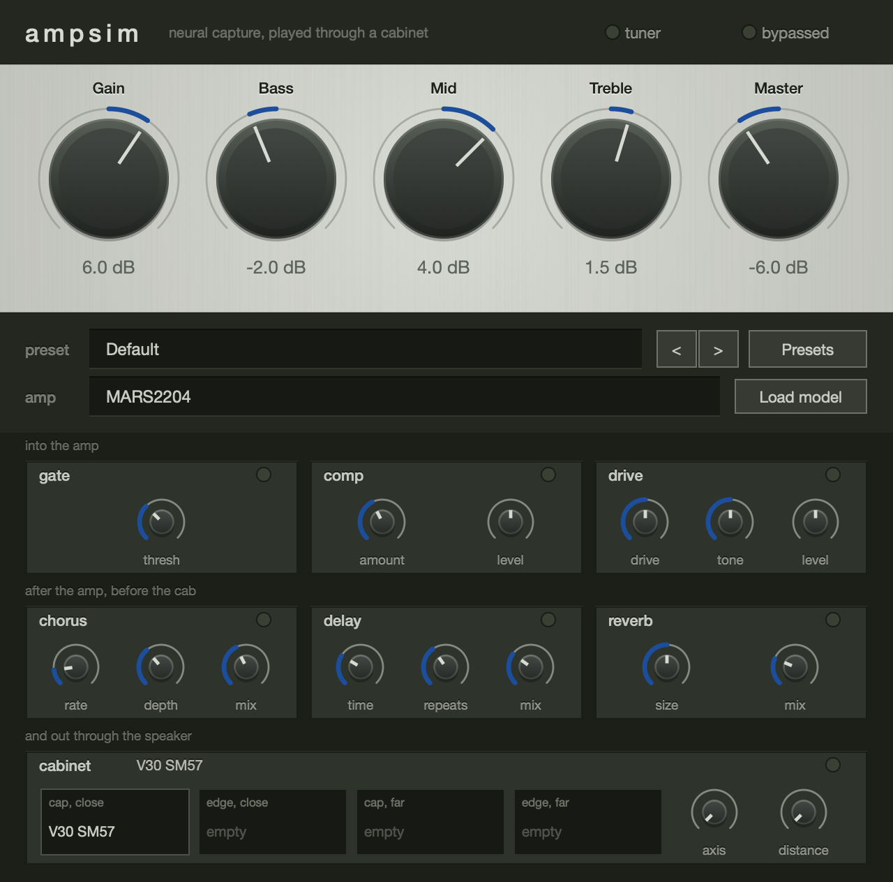

# AmpSim

[](https://github.com/CatastrophicCoder/ampsim/actions/workflows/build.yml)

A guitar amp simulator for macOS — AU, VST3 and a standalone app — built with JUCE around a
[Neural Amp Modeler](https://github.com/sdatkinson/NeuralAmpModelerCore) capture.



The amp itself is a `.nam` file: a neural network trained on a real amplifier. What this project
adds is everything a capture on its own does not give you — an amp's controls, a cabinet, a
pedalboard in the order a real rig is plugged up, and a tuner.

It is deliberately small. There is one amp model at a time, one cabinet, six pedals, and no attempt
at a channel switcher, a rack, or a library of tones.

## The signal chain

```
gate → compressor → drive → Gain → NAM model → Bass/Mid/Treble → Master
     → chorus → delay → reverb → cabinet IR
```

Mono from end to end, because a guitar amp is and a NAM capture is; a stereo input is summed in at
the top. The placement is fixed rather than user-reorderable, because it is the point: a drive
pedal in front of the amp changes what the amp distorts, while modulation and echoes belong after
it so the repeats are of the already-distorted tone.

## Building

Full Xcode is not needed — the Command Line Tools build and sign all three formats, and `auval`
ships with macOS.

| | Version used here | |
| --- | --- | --- |
| Xcode Command Line Tools | Apple clang 17 | `xcode-select --install` |
| CMake | 4.4.3 (JUCE needs ≥ 3.24) | `brew install cmake` |
| Ninja | 1.13.2 | `brew install ninja` |
| pluginval | 1.0.4 (optional) | `brew install --cask pluginval` |

JUCE 9.0.2, NeuralAmpModelerCore v0.5.4 (which brings Eigen and nlohmann/json) and Catch2 v3.9.1
are pinned submodules.

```sh
git clone --recursive https://github.com/CatastrophicCoder/ampsim.git
cd ampsim
cmake -B build -G Ninja -DCMAKE_BUILD_TYPE=Debug
cmake --build build
```

Without `--recursive`, or after pulling a change that moves a submodule,
`git submodule update --init --recursive` does the same job — NAM Core has submodules of its own,
so the recursion matters.

`COPY_PLUGIN_AFTER_BUILD` is on, so a build drops the AU and VST3 into `~/Library/Audio/Plug-Ins/`.
Use `-DCMAKE_BUILD_TYPE=Release` for anything you intend to judge by ear — a Debug build is far
slower and says nothing useful about CPU load.

JUCE is pinned on purpose: Apple toolchain and JUCE updates are a reliable source of "the build
broke and nothing changed". Update it deliberately, in its own commit, and re-validate afterwards.

## Installing

```sh
./packaging/package.sh          # or: cmake --build build --target package-macos
```

Builds Release, ad-hoc signs everything and writes an installer and a disk image to
`build-release/artefacts`. No Apple Developer Program membership is needed to build or package.

The cost lands on whoever installs it: the packages carry no Developer ID, so macOS blocks them on
first launch until the person goes to **System Settings → Privacy & Security** and clicks **Open
Anyway**. [`packaging/README.md`](packaging/README.md) covers that, what ad-hoc signing does and
does not do, and what would change with a Developer ID.

## Using it

**An amp and a cab are built in**, so a fresh instance makes a sound rather than passing audio
through untouched: `MARS2204`, a capture of a well-known British 100-watt head, into `V30 SM57`, a
4x12 close-miked on axis. They are written out to
`~/Library/Application Support/AmpSim/Bundled/` on first run and loaded from there.

They travel inside the binary packed rather than as a plain `.nam` and `.wav` — see
[`src/AssetPack.h`](src/AssetPack.h) for the format and what it is and is not for. Load anything
else over them at any time; the public NAM model libraries and any cabinet IR work.

**In the standalone, untick "Mute audio input"** in Options the first time. JUCE mutes a
standalone's input by default, which is right for a synth and wrong for an amp — with it ticked the
meters move and nothing is heard.

**Amp.** Gain sits before the model, so turning it up drives the network harder and it saturates,
the way a preamp gain control does — with a real capture, 12 dB more input yields well under a
decibel more output. Bass, Mid and Treble are independent parametric bands (low shelf 100 Hz, peak
800 Hz, high shelf 3.2 kHz, ±12 dB) between the model and the cab. Master is the level out of the
amp. Because the bands are parametric rather than a modelled passive network, all three centred is
genuinely flat and each moves only its own band — a real tone stack interacts with itself and is
mid-scooped at noon.

**Cabinet.** Four corners of a mic position — on and off axis, close and far — with axis and
distance knobs blending between them. Click a corner to load or clear an IR. Fill one corner and it
is a plain IR loader. A stereo IR is folded to mono.

Captures are not made to a common level — a commercial pack can carry 15 dB of broadband gain — so
the cab normalises, using the average magnitude across the range a guitar occupies. One factor is
applied to the whole grid rather than one per corner, so a corner that really is quieter, a mic
backed off or off axis, stays quieter; only the grid's overall level is brought to unity. The factor
comes from the loudest loaded corner, so filling the corners in a different order cannot change the
result.

**Pedals.** Six, in the two groups the chain diagram shows. A blue lamp means the pedal is in your
signal; a red lamp on the amp means something is switched *out* of it. Chorus, delay and reverb keep
running while switched off, so engaging one picks up repeats already in flight instead of starting
from an empty line.

**Tuner.** The switch in the header. It reads the guitar before the pedals and the amp, shows the
note and how far off it is in cents, and mutes the output while it is on.

**Presets** are files in `~/Library/Application Support/AmpSim/Presets`. A preset holds everything —
controls, MIDI map, and the paths of the model and cabs — but anything it leaves empty keeps what is
already loaded, so a preset that only sets the knobs will not unload your amp.

**MIDI.** Right-click any control to learn a CC for it, or to forget the one it has. One controller
drives one parameter and one parameter answers to one controller. The map is saved with the session
and travels with a preset.

**Latency.** The model runs at the rate it was trained at — usually 48 kHz — and the plugin converts
in and out at any other session rate, reporting about 220 samples at 44.1 kHz for the host to
compensate. The drive pedal's 4x oversampler adds 5 more, and runs whether or not the pedal is
engaged so that the figure never changes under the host.

## Testing

```sh
ctest --test-dir build                        # 73 tests
ctest --test-dir build --output-on-failure
ctest --test-dir build -R "bypass"            # one test, or a pattern
```

The tests link the plugin's own shared-code target, so they exercise the same objects the AU, VST3
and standalone builds ship. They measure DSP behaviour — band responses, resampler latency against
a real impulse, whether switching a pedal introduces a discontinuity the pedal does not already
make — which is the layer plugin validators never look at. `-DAMPSIM_BUILD_TESTS=OFF` skips them.

```sh
auval -v aumf Amp1 Amps
/Applications/pluginval.app/Contents/MacOS/pluginval --strictness-level 10 \
    --validate build/AmpSim_artefacts/Debug/VST3/AmpSim.vst3
```

Both pass. The AU is type `aumf`, a music effect rather than `aufx`, because it accepts MIDI for
controller mapping — in Logic that puts it under MIDI-controlled effects.

CI runs all of this on every push: a Release build, the test suite, both validators, and the
packaging script, with the installer and disk image uploaded as artefacts. See
[`.github/workflows/build.yml`](.github/workflows/build.yml).

## Roadmap

[`docs/roadmap.md`](docs/roadmap.md) holds what is agreed but not built — currently a rework of the
panel's appearance.

## Reading the code

[`CLAUDE.md`](CLAUDE.md) is the architecture note: what each block is, which thread may touch it,
and the handful of JUCE behaviours that cost time to discover — a default-constructed `dsp::Gain`
sitting at zero, `Convolution` installing an engine before any IR is loaded, `IIR::Coefficients`
factories allocating on every call. It is written for whoever works on this next, including an AI
assistant.

## What it does not do

- **macOS and Apple silicon only.** Nothing is Mac-specific in the DSP, but no other platform has
  been built or tested.
- **Mono.** Stereo input is summed at the top of the chain.
- **One model, one cabinet, no channel switching.**
- **The mic-position blend is unproven musically.** The interpolation is exact and tested, but
  whether it sounds like moving a microphone depends entirely on having a grid of IRs of one cab
  captured at known positions. None ship here.
- **Nothing is notarised**, so anyone you give a build to has to allow it through Gatekeeper.

## Licence

[GNU AGPL v3](LICENSE). AmpSim links JUCE, which since version 8 is offered under AGPLv3 or a paid
licence; this project takes the open-source option, so the same terms apply to it. In practice that
means anyone distributing a binary built from this source has to make the corresponding source
available. Read JUCE's current terms at [juce.com](https://juce.com) before relying on any of this —
they have changed between major versions.

Third-party code, all as pinned submodules rather than vendored copies:

| | Licence |
| --- | --- |
| [JUCE](https://github.com/juce-framework/JUCE) | AGPLv3 or commercial |
| [NeuralAmpModelerCore](https://github.com/sdatkinson/NeuralAmpModelerCore) | MIT |
| [Eigen](https://gitlab.com/libeigen/eigen) | MPL2 |
| [nlohmann/json](https://github.com/nlohmann/json) | MIT |
| [Catch2](https://github.com/catchorg/Catch2) | BSL-1.0 |
| VST3 SDK (bundled with JUCE) | GPLv3 or Steinberg's proprietary terms |

Amp captures and impulse responses carry their own licences, and some are captures of trademarked
amplifiers — a personal build can use them; publishing a plugin with an amp's name on it cannot.
