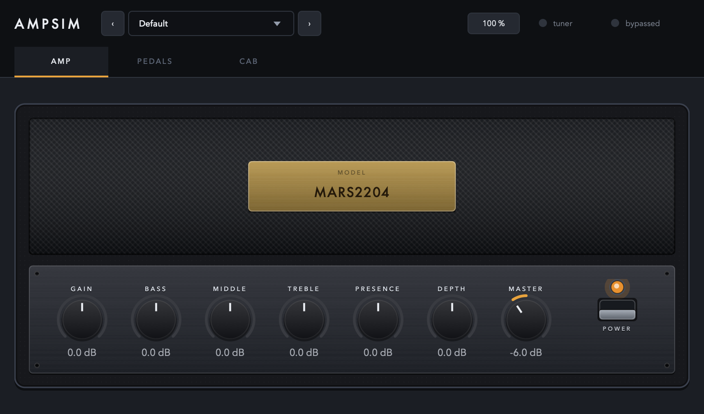
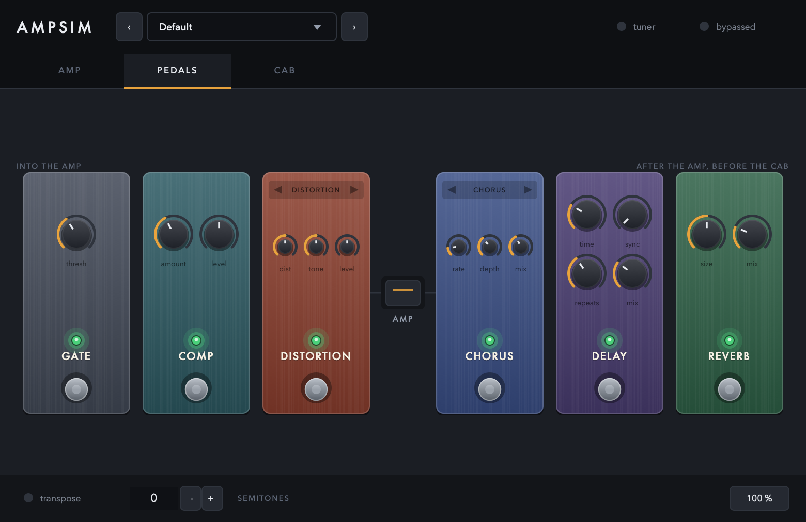

<div align="center">

# AmpSim

**A guitar amp simulator for macOS, by Catastrophic Audio**

[](LICENSE)


[](https://github.com/CatastrophicCoder/ampsim/actions/workflows/build.yml)

[Download](https://github.com/CatastrophicCoder/ampsim/releases) &middot;
[User guide](https://catastrophiccoder.github.io/ampsim/) &middot;
[Signal chain](#the-signal-chain) &middot;
[Building](#building) &middot;
[Architecture](CLAUDE.md)



</div>

AmpSim is an open-source guitar amp plugin built with JUCE around a
[Neural Amp Modeler](https://github.com/sdatkinson/NeuralAmpModelerCore) capture. The amp itself is
a `.nam` file: a neural network trained on a real amplifier. What this project adds is everything a
capture on its own does not give you — an amp's controls, a cabinet, a pedalboard in the order a
real rig is plugged up, and a tuner.

It is deliberately small. There is one amp model at a time, one cabinet, six pedals, and no attempt
at a channel switcher, a rack, or a library of tones.

## The signal chain

```
compressor → drive → Gain → NAM model → Bass/Mid/Treble → Master
           → gate → chorus → delay → reverb → cabinet IR
```

The gate is the odd one out: it measures the guitar at the very front and closes on the other side
of the amp. A gate only in front cannot remove hiss the amp itself makes, and a gate only behind it
has no dynamics left to trigger on — which is why hardware gates for high-gain rigs have a key
input, and why this one works the same way.

Mono from end to end, because a guitar amp is and a NAM capture is; a stereo input is summed in at
the top. The placement is fixed rather than user-reorderable, because it is the point: a drive
pedal in front of the amp changes what the amp distorts, while modulation and echoes belong after
it so the repeats are of the already-distorted tone.

## Download and install

Ready-made packages are on the [releases page](https://github.com/CatastrophicCoder/ampsim/releases).
The `.pkg` installs the AU and VST3 into `/Library/Audio/Plug-Ins/` and the standalone app into
`/Applications`; the `.dmg` holds just the app. In Logic the plugin appears as
**Catastrophic Audio: AmpSim**, under MIDI-controlled effects.

To build your own:

```sh
./packaging/package.sh          # or: cmake --build build --target package-macos
```

Builds Release, ad-hoc signs everything and writes an installer and a disk image to
`build-release/artefacts`. No Apple Developer Program membership is needed to build or package.

The cost lands on whoever installs it: the packages carry no Developer ID, so macOS blocks them on
first launch until the person goes to **System Settings → Privacy & Security** and clicks **Open
Anyway**. [`packaging/README.md`](packaging/README.md) covers that, what ad-hoc signing does and
does not do, and what would change with a Developer ID.

## Using it

The **[user guide](https://catastrophiccoder.github.io/ampsim/)** is the place to start: an
annotated tour of the amp, the pedalboard and the cabinet, and walkthroughs for getting a first
sound, dialling in a tone, loading your own capture and impulse responses, using the pedals in the
order they are in, tuning up, and putting a control on a MIDI pedal.

Two things worth knowing before you open it:

**Captures are level-matched.** A `.nam` file records how loud it is, and two captures of the same
amp can be 15 dB apart; AmpSim brings each to a common reference on load, so swapping one for
another does not mean re-setting Master by ear. A capture that does not carry a loudness is left
alone.

**An amp and a cab are built in**, so a fresh instance makes a sound rather than passing audio
through untouched: `MARS2204`, a capture of a well-known British 100-watt head, into `V30 SM57`, a
4x12 close-miked on axis. They are written out to
`~/Library/Application Support/AmpSim/Bundled/` on first run and loaded from there. They travel
inside the binary packed rather than as a plain `.nam` and `.wav` — see
[`src/AssetPack.h`](src/AssetPack.h) for the format and what it is and is not for. Load anything
else over them at any time; the public NAM model libraries and any cabinet IR work.

**In the standalone, untick "Mute audio input"** in Options the first time. JUCE mutes a
standalone's input by default, which is right for a synth and wrong for an amp — with it ticked the
meters move and nothing is heard.



## Building

Full Xcode is not needed — the Command Line Tools build and sign all three formats, and `auval`
ships with macOS.

| | Version used here | |
| --- | --- | --- |
| Xcode Command Line Tools | Apple clang 17 | `xcode-select --install` |
| CMake | 4.4.3 (JUCE needs ≥ 3.24) | `brew install cmake` |
| Ninja | 1.13.2 | `brew install ninja` |
| pluginval | 1.0.4 (optional) | `brew install --cask pluginval` |

JUCE 9.0.2, NeuralAmpModelerCore v0.5.4 (which brings Eigen and nlohmann/json) and Catch2 v3.9.1
are pinned submodules.

```sh
git clone --recursive https://github.com/CatastrophicCoder/ampsim.git
cd ampsim
cmake -B build -G Ninja -DCMAKE_BUILD_TYPE=Debug
cmake --build build
```

Without `--recursive`, or after pulling a change that moves a submodule,
`git submodule update --init --recursive` does the same job — NAM Core has submodules of its own,
so the recursion matters.

`COPY_PLUGIN_AFTER_BUILD` is on, so a build drops the AU and VST3 into `~/Library/Audio/Plug-Ins/`.
Use `-DCMAKE_BUILD_TYPE=Release` for anything you intend to judge by ear — a Debug build is far
slower and says nothing useful about CPU load.

JUCE is pinned on purpose: Apple toolchain and JUCE updates are a reliable source of "the build
broke and nothing changed". Update it deliberately, in its own commit, and re-validate afterwards.

## Testing

```sh
ctest --test-dir build                        # 102 tests
ctest --test-dir build --output-on-failure
ctest --test-dir build -R "bypass"            # one test, or a pattern
```

The tests link the plugin's own shared-code target, so they exercise the same objects the AU, VST3
and standalone builds ship. They measure DSP behaviour — band responses, resampler latency against
a real impulse, whether switching a pedal introduces a discontinuity the pedal does not already
make — which is the layer plugin validators never look at. `-DAMPSIM_BUILD_TESTS=OFF` skips them.

```sh
auval -v aumf Amp1 Ctcd
/Applications/pluginval.app/Contents/MacOS/pluginval --strictness-level 10 \
    --validate build/AmpSim_artefacts/Debug/VST3/AmpSim.vst3
```

Both pass. The AU is type `aumf`, a music effect rather than `aufx`, because it accepts MIDI for
controller mapping — in Logic that puts it under MIDI-controlled effects.

CI runs all of this on every push: a Release build, the test suite, both validators, and the
packaging script, with the installer and disk image uploaded as artefacts. See
[`.github/workflows/build.yml`](.github/workflows/build.yml).

## Roadmap

[`docs/roadmap.md`](docs/roadmap.md) holds what is agreed but not built, and records what the panel
rework decided so those choices are not re-argued.

## Reading the code

[`CLAUDE.md`](CLAUDE.md) is the architecture note: what each block is, which thread may touch it,
and the handful of JUCE behaviours that cost time to discover — a default-constructed `dsp::Gain`
sitting at zero, `Convolution` installing an engine before any IR is loaded, `IIR::Coefficients`
factories allocating on every call. It is written for whoever works on this next, including an AI
assistant.

## What it does not do

- **macOS and Apple silicon only.** Nothing is Mac-specific in the DSP, but no other platform has
  been built or tested.
- **Mono.** Stereo input is summed at the top of the chain.
- **One model, one cabinet, no channel switching.**
- **The mic-position blend is unproven musically.** The interpolation is exact and tested, but
  whether it sounds like moving a microphone depends entirely on having a grid of IRs of one cab
  captured at known positions. None ship here.
- **Nothing is notarised**, so anyone you give a build to has to allow it through Gatekeeper.

## Licence

[GNU AGPL v3](LICENSE). AmpSim links JUCE, which since version 8 is offered under AGPLv3 or a paid
licence; this project takes the open-source option, so the same terms apply to it. In practice that
means anyone distributing a binary built from this source has to make the corresponding source
available. Read JUCE's current terms at [juce.com](https://juce.com) before relying on any of this —
they have changed between major versions.

Third-party code, all as pinned submodules rather than vendored copies:

| | Licence |
| --- | --- |
| [JUCE](https://github.com/juce-framework/JUCE) | AGPLv3 or commercial |
| [NeuralAmpModelerCore](https://github.com/sdatkinson/NeuralAmpModelerCore) | MIT |
| [Eigen](https://gitlab.com/libeigen/eigen) | MPL2 |
| [nlohmann/json](https://github.com/nlohmann/json) | MIT |
| [Catch2](https://github.com/catchorg/Catch2) | BSL-1.0 |
| VST3 SDK (bundled with JUCE) | GPLv3 or Steinberg's proprietary terms |

Amp captures and impulse responses carry their own licences, and some are captures of trademarked
amplifiers — a personal build can use them; publishing a plugin with an amp's name on it cannot.
