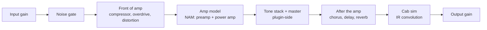

# Guitar Amp Sim Plugin – Hobby Project Plan

2026-09-21 · @Kimmo

## Goal

Build a **minimal guitar amp simulator plugin** that uses Neural Amp Modeler for the actual amp tone, and puts a custom amp-like interface and the surrounding signal chain on top of it. Four parts, in order of importance:

1. **Amp — NAM under the hood.** The modelled amp is a pre-trained `.nam` file run through NeuralAmpModelerCore. No amp DSP is written by hand; the model supplies the tone.
2. **Custom amp-like UI with real controls.** A front panel with Gain, a three-band EQ (Bass, Mid, Treble) and Master Volume. Because a `.nam` capture is a snapshot of one amp setting, these knobs are not inside the model — each is a plugin-side DSP stage placed before or after it (see Architecture). This layer is the project's own contribution and the reason it is not just a NAM loader.
3. **Cabinet — an IR file loader.** One `.wav` impulse response loaded into a convolution engine, with a bypass switch. No multi-mic positioning, no 3D cab modelling.
4. **Pedal section, placed like real hardware.** Standard effect modules with per-pedal bypass, positioned in the chain where the corresponding pedal goes in a physical rig: gain-stage pedals (noise gate, compressor, overdrive, distortion) **in front of the amp**, modulation and time-based effects (chorus, delay, reverb) **after the amp**. The placement is fixed, not user-reorderable — that is the point of it.

Minimal is the operative word: anything not on that list — tuner, MIDI mapping, presets, multi-mic cabs, parametric or multi-gain amp models, Windows builds, installers — is explicitly out of the initial scope and listed under Milestone 7. The sections below work out what that costs and in what order to build it, using the commercial product described next as the yardstick for what a full-featured version of each part would mean.

## What Amped Block Letter is

[Amped Block Letter](https://ml-sound-lab.com/pages/amped-block-letter) is a €59.99 commercial guitar plugin (Windows/Mac; Standalone, VST3, AU, Mac AAX) modelling two high-gain tube amps, plus a cab simulator, a pedalboard, a tuner and MIDI control. It bundles five distinct product features into one signal chain, and each maps to a separately buildable component of a hobby project.

| Feature | What the page says it does | Hobby-project equivalent |
| --- | --- | --- |
| Amp models | Six amp sims: 5555 and 6666, each with Lead, Crunch and Clean channels, on the proprietary "Vorna Amp Modeling" engine | Non-linear amp DSP: preamp gain stages, tone stack, power amp; either circuit-modelled (WDF/white-box) or neural (black-box capture) |
| 3D cab sim | Two 4x12 cabs (V30 and Greenback), multiple mics; mic position front/back, centre-to-edge, angle; user IR loading | Convolution engine loading impulse responses (IRs); mic positioning implemented as interpolation between a grid of pre-captured IRs |
| Pedalboard | Noise gate, compressor, drive, chorus, analog delay, reverb | Six standard effect modules in two fixed groups, placed as they would be in a physical rig: dirt and dynamics in front of the amp, modulation and time after it |
| Standalone app | MIDI-controllable, "stage ready" | JUCE standalone target with audio device selection and MIDI mapping |
| Tuner | Pitch detection with UI | Zero-crossing or autocorrelation pitch detector, display component |

The page gives no detail about how Vorna works internally, and no latency or CPU figures. The word "modelling" and the "capture packs" product line elsewhere on the site are consistent with either approach in the table above; treat the internal method as unknown.

## Revised scope: NAM under the hood

Yes, the project can rely on Neural Amp Modeler for the amp tone: NAM ships its real-time engine as a separate MIT-licensed C++ library, [NeuralAmpModelerCore](https://github.com/sdatkinson/NeuralAmpModelerCore) (docs version [0.6.0](https://neuralampmodelercore.readthedocs.io/en/latest/)), and at least two JUCE plugins already embed it. The revised scope is: NAM Core for the amp, a custom amp-style UI whose knobs shape the signal around the model, an IR file loader for the cab, the pedalboard as specified, and the tuner deferred.

What NAM Core gives you and what it does not:

| Aspect | Fact | Consequence for this project |
| --- | --- | --- |
| Licence | MIT ([LICENSE](https://github.com/sdatkinson/NeuralAmpModelerCore/blob/main/LICENSE)) | Usable in a closed or open plugin; only attribution required |
| Dependencies | Eigen (header-only linear algebra) and nlohmann/json for `.nam` parsing; C++17 | Two extra submodules; the README warns about Eigen memory alignment under some compiler optimisations |
| Architectures | WaveNet (the standard NAM model), ConvNet, LSTM, Linear (IRs), Sequential (chained models) | Any `.nam` file from the public model libraries loads; a Linear model could even carry the cab IR |
| API | `nam::get_dsp(path)` returns a `DSP` object; `process(input, output, numFrames)` runs it; pre-allocated buffers, no allocation while processing | Fits a JUCE `processBlock` directly; loading must happen off the audio thread |
| Sample rate | A model has a native sample rate (typically 48 kHz) stored in the file | Resample in the plugin when the host runs at another rate; nam-juce shows one implementation |
| Knobs | A standard NAM capture is a snapshot of one amp setting; the core has FiLM conditioning for parametric models, but the mainstream trainer and public model libraries are snapshot-based | Gain, bass, mid, treble and master have to be implemented in the plugin around the model, not inside it (see Architecture) |
| CPU | A "standard" WaveNet runs comfortably on a modern Mac at a 128-sample buffer; the repo ships a `benchmodel` tool | Measure on your machine before choosing default model size |

Existing JUCE integrations to read first:

- [Tr3m/nam-juce](https://github.com/Tr3m/nam-juce): a JUCE re-implementation of the official NAM plugin; release [v0.4.0](https://github.com/Tr3m/nam-juce/releases) (8 Sep 2026) tracks NAM Core upstream, adds resampling, and builds AU/VST3/Standalone with CMake. Its `CMakeLists.txt` shows exactly how to add NAM Core, Eigen and json as submodules and compile the core's `.cpp` files into a `juce_add_plugin` target.
- [tonalflex/tonalflex-neuralamp-plugin](https://www.github.com/tonalflex/tonalflex-neuralamp-plugin): JUCE + NAM Core with `.nam` loading, IR handling and a WebView UI; also cross-compiles headless for embedded Linux.

Both are reference material for wiring, not a starting point to fork: the value of this project is the amp-style control set and UI on top, which neither has. Check each repo's own licence before copying code.

## What a comparable project requires

With NAM Core supplying the amp model, the remaining work is standard audio-plugin engineering that JUCE covers well, plus the tone-shaping DSP around the model. Six areas of knowledge are needed, at different depths; the non-linear modelling row is now mostly reading, since the model runs from a file.

| Area | What you need | Depth for a hobby build |
| --- | --- | --- |
| Real-time C++ | Lock-free audio thread (no allocation, locks, or I/O in `processBlock`), parameter smoothing, denormal handling, SIMD awareness | Essential from day one; most plugin bugs are here |
| JUCE plugin framework | `AudioProcessor`, `AudioProcessorValueTreeState`, `juce::dsp` module, editor/component model, state save/load, standalone wrapper | Core; tutorials cover it in 2–4 weeks |
| DSP fundamentals | Sample-rate handling, oversampling, FIR/IIR filters, biquad design, convolution (FFT-based, partitioned for low latency) | Needed for cab sim, tone stack, pedals |
| Non-linear amp modelling | One of: (a) white-box circuit modelling (wave digital filters, Newton–Raphson solvers for triode stages); (b) black-box neural capture (LSTM/WaveNet-style networks trained on recorded input/output pairs, run with a real-time inference library) | The choice defines the project; see Architecture below |
| Audio measurement | Recording test signals, comparing frequency response and harmonic content, null tests against a reference | Needed to know whether a model is right |
| Product packaging | Code signing/notarization on macOS, installers, presets, IR file management | Only if you distribute; skip for a personal build |

What you do not need: a real amp to measure, if you go the neural route and use published capture datasets or existing open model files; a Windows machine, until you want a Windows build; a commercial JUCE licence, as long as you stay within the free tier or release under GPLv3 (see Risks and licensing).

## Milestones

With NAM Core handling the amp tone, the order changes: get a `.nam` model playing first, then build the amp-style controls around it, then cab and pedals. Each milestone still produces something you can plug a guitar into. Time estimates assume roughly 5–8 hours a week alongside work and studies.

| # | Milestone | Done when | Estimated effort |
| --- | --- | --- | --- |
| 0 | Toolchain | JUCE example plugin builds from CLion, loads in a DAW and as standalone, git repo initialised | 1 weekend |
| 1 | Gain + bypass plugin | Input/output gain and bypass with `AudioProcessorValueTreeState`; state saves and reloads; UI has two knobs | 1–2 weeks |
| 2 | NAM model playing | NAM Core, Eigen and json added as submodules; a `.nam` file loads on a background thread and processes audio; model path saved in plugin state; resampling when host rate differs from the model's | 2–4 weeks |
| 3 | IR loader (cab) | Load a `.wav` IR, run `juce::dsp::Convolution`, bypass switch, IR path in state | 1–2 weeks |
| 4 | Amp-style controls | Gain, bass, mid, treble, master knobs that shape the signal as described under Architecture; matched-loudness A/B shows each knob does what its label says | 3–5 weeks |
| 5 | Amp-style UI | Custom `LookAndFeel` for knobs, panel graphics, model and IR pickers; parameters bound via attachments | 3–4 weeks |
| 6 | Pedalboard | Front-of-amp group (noise gate, compressor, overdrive/distortion) and post-amp group (chorus, delay, reverb) as chained modules; per-pedal bypass; UI shows which side of the amp each pedal sits on | 4–6 weeks |
| 7 | Deferred | Tuner, MIDI CC mapping, presets, multi-mic cab, notarised installer | As interest dictates |

Milestone 4 is the one that distinguishes this plugin from a plain NAM loader and carries the most design work; milestones 3, 5 and 6 are independent of each other and can be reordered.

## Toolchain setup (macOS, CLion, JUCE, C++)

Use JUCE via CMake rather than the Projucer: CLion is a CMake-native IDE, and the CMake route keeps the project buildable from the command line and CI. The current JUCE release is [9.0.2](https://github.com/juce-framework/JUCE/releases/tag/9.0.2) (7 Sep 2026); JUCE requires CMake 3.22 or newer.

1. Install Xcode from the App Store and run `xcode-select --install`; JUCE needs the Apple SDKs and the AU/AudioUnit tooling even when building from CLion.
2. Install CMake (`brew install cmake`) and Ninja (`brew install ninja`) for faster incremental builds.
3. Install CLion and set its toolchain to the Xcode-provided clang, generator Ninja.
4. Add JUCE as a git submodule (`git submodule add https://github.com/juce-framework/JUCE.git external/JUCE`) and pin it to the 9.0.2 tag, or use CMake `FetchContent`.
5. Write a `CMakeLists.txt` with `juce_add_plugin(...)`, formats `AU VST3 Standalone`, and link `juce::juce_audio_utils` and `juce::juce_dsp`.
6. Build the Standalone target from CLion and run it; build the AU target and confirm it appears in Logic, GarageBand or Reaper (Reaper is the most convenient free-to-evaluate host for plugin testing).
7. Set up `auval -v aufx <subtype> <manu>` for AU validation and the free [pluginval](https://github.com/Tracktion/pluginval) for automated plugin conformance tests.

Repository layout to start with:

```markdown
ampsim/
  CMakeLists.txt
  external/JUCE/          (submodule, pinned)
  external/               (RTNeural, chowdsp_wdf, etc. as needed)
  src/
    PluginProcessor.h/.cpp
    PluginEditor.h/.cpp
    dsp/                  (one file per stage: Cab, Amp, Gate, ...)
    ui/
  resources/irs/          (bundled IR .wav files → BinaryData)
  tests/                  (Catch2 or GoogleTest, offline DSP tests)
```

A well-maintained template that already wires JUCE + CMake + tests + GitHub Actions is [pamplejuce](https://github.com/sudara/pamplejuce); starting from it saves the first weekend but adds conventions you did not choose. Starting from JUCE's own `examples/CMake/AudioPlugin` is the minimal alternative.

## Architecture and DSP design

The plugin is a fixed mono signal chain (stereo only after the cab or effects stage) where each block is a self-contained `juce::dsp` processor with `prepare`, `process` and `reset`. Parameters live in one `AudioProcessorValueTreeState`; the UI only reads and writes that tree.



The amp block is NAM Core wrapped in plugin-side DSP that makes the front-panel knobs behave like an amp's. A snapshot `.nam` model captures one setting, so each control is realised by a stage before or after the model; the table gives the standard approach used by NAM-based plugins and its limits.

| Control | Where it acts | Implementation | Limit vs. a real amp |
| --- | --- | --- | --- |
| Gain | Before the model | Input gain in dB (roughly -20 to +20). Because the network is nonlinear, more level in means more saturation out, which is how the real preamp gain knob also works | Range is bounded by what the capture heard; far above the capture level the model extrapolates and can sound wrong |
| Bass / Mid / Treble | After the model, before the post-amp pedals | A modelled passive tone stack (e.g. the Fender/Marshall type analysed in Yeh & Smith 2006) or three parametric bands: low shelf, mid peak, high shelf | A real tone stack sits between preamp and power amp and interacts with both; here it only colours the captured result |
| Presence (optional) | After the model | High shelf around 3–5 kHz. Not part of the minimal control set in the Goal; add it only if the three-band EQ proves too blunt | Real presence works in the power-amp feedback loop; approximated here |
| Master / output | After the model | Output gain in dB | A real master drives the power amp into saturation; a second waveshaper stage after the model can imitate that if wanted |
| Model selector | Replaces the model | Combo box of `.nam` files in a user folder, loaded on a background thread, swapped with an atomic pointer | Load takes tens of milliseconds; audio should crossfade or mute briefly |

An alternative with truer knob behaviour is to capture the same amp at several gain settings and interpolate between models, or to train one parametric model with the core's FiLM conditioning; both need access to a real amp and a training pipeline, so they are out of the initial scope and listed under open questions.

Cab sim: `juce::dsp::Convolution` with a uniformly partitioned FFT already handles IR loading, resampling to the session rate, and near-zero-latency convolution. In the revised scope the cab is one IR file loader with a bypass switch; multi-mic positioning is deferred.

### Pedal section: hardware placement

The pedals are not a generic effects rack; they sit where the equivalent hardware would sit, and the chain order is fixed rather than user-reorderable. Two groups:

| Group | Pedals | Position | Why there |
| --- | --- | --- | --- |
| Front of amp | Noise gate, compressor, overdrive, distortion | Between input gain and the amp model | These pedals work by feeding a different signal *into* the preamp — an overdrive in front of a cranked amp changes how the amp itself distorts, which is the whole reason players use one. Running them after the amp would just add fizz on top of an already-distorted signal. The gate goes first so it acts on the raw guitar level, before a compressor or drive raises the noise floor |
| After the amp | Chorus, delay, reverb | Between the amp model and the cab IR | Modulation and time-based effects are put in an amp's effects loop, or after the amp in a recorded chain, so that the repeats and the modulated copies are of the already-distorted tone. In front of a high-gain amp they turn to mush, because the amp distorts the wet signal along with the dry |

Consequences for the code:

- The pedal chain is two separate `juce::dsp::ProcessorChain`-style groups, not one list. The UI can present them as one pedalboard, but the processor keeps `preAmpChain` and `postAmpChain` distinct, with the amp block between them.
- Per-pedal bypass is a parameter per pedal, not a chain-rebuild: bypassed pedals stay in the chain and pass through, so no allocation or reordering happens on the audio thread.
- Overdrive and distortion are waveshapers and need 2x–4x oversampling; the modulation and time effects do not.

One limitation is worth stating plainly: a real effects loop sits between the preamp and the power amp, but a `.nam` capture is of the **whole amp**, so there is no point inside the model to insert anything. The post-amp group therefore goes outside the model, as close to the amp as the capture allows.

**Settled: the post-amp pedals run before the cab IR**, i.e. amp → tone stack → chorus/delay/reverb → cab. This is the loop-like position: everything the effects produce still passes through the speaker response, so delay repeats and reverb tails are filtered exactly like the dry signal, as they would be coming out of a real cabinet. The alternative — effects after the cab, on the miked sound, which is what most amp sims and studio chains do — is not used here. Two practical consequences: the cab convolution now runs on the wet signal, so its CPU cost is unchanged but reverb tails are audibly darker than the post-cab version; and if the plugin ever gains a stereo modulation or ping-pong delay, the cab must process both channels, since the stereo image is created before it.

Oversampling: NAM models run at their native rate and do not need oversampling; the drive pedal and any post-model waveshaper should run 2x–4x via `juce::dsp::Oversampling` to keep aliasing out of the audible band.

Threading rules: the audio thread never allocates, locks, or touches files. IR loading and model loading happen on a background thread and are swapped in with an atomic pointer or JUCE's `Convolution::loadImpulseResponse`, which already does this internally.

## Testing and validation

Test the DSP offline in plain C++ unit tests, and test the plugin shell with automated hosts; ears come last, because they cannot tell you why something is wrong.

- Offline DSP tests (Catch2 or GoogleTest, run from CLion): render a known signal through each block and assert on measurable properties, such as the -3 dB point of a filter, the RMS of a gated silence, or the peak of an impulse through the convolution being the IR's peak.
- Null tests: process a recorded clean DI track through your amp model and through the reference (a real amp recording or a NAM model of it), invert one, sum, and measure the residual in dB. A residual below about -40 dB is close; below -60 dB is hard to hear.
- Frequency and harmonic sweeps: a swept sine at several input levels through the amp block, plotted with Python (`numpy`, `scipy.signal`, `matplotlib`) from a `.wav` the test writes. This shows tone-stack accuracy and aliasing at once.
- Plugin conformance: run `pluginval --strictness-level 5` on every build; run Apple's `auval` before any AU release. Both catch threading and state bugs a DAW hides.
- Real-time safety: enable Address Sanitizer and Thread Sanitizer builds in CLion; check `processBlock` with Xcode Instruments' Time Profiler at a 64-sample buffer to confirm headroom.
- Manual listening: only after the above, with a fixed DI track, at matched loudness, A/B against the reference. Keep notes per build so tone drift is traceable.

Test material: record a few minutes of clean DI guitar once (any audio interface with a Hi-Z input) and keep it in `tests/fixtures/`. Open datasets used for training neural amp models also ship DI + amp pairs and can serve as reference material.

## Learning resources and open-source references

Everything in the reference product has an open-source counterpart you can read, build and compare against. Read code before theory: a working amp-sim repo shows what a hobby-sized implementation actually looks like.

| Resource | What it is | Use it for |
| --- | --- | --- |
| [JUCE tutorials](https://juce.com/learn/tutorials) and the `examples/CMake` directory in the JUCE repo | Official getting-started material; the CMake examples include a complete plugin | Milestones 0–1 |
| [pamplejuce](https://github.com/sudara/pamplejuce) | JUCE + CMake + Catch2 + GitHub Actions template | Milestone 0, tests, CI |
| [NeuralAmpModelerCore](https://github.com/sdatkinson/NeuralAmpModelerCore) and its [docs](https://neuralampmodelercore.readthedocs.io/en/latest/) | MIT-licensed C++ engine that loads and runs `.nam` models; API reference, WaveNet walkthrough, file-format versions | Milestone 2 |
| [Tr3m/nam-juce](https://github.com/Tr3m/nam-juce) | JUCE plugin embedding NAM Core; CMake wiring, resampling, model loading | Milestone 2, as a worked example |
| [Neural Amp Modeler](https://github.com/sdatkinson/neural-amp-modeler) (Python) and its official [plugin](https://github.com/sdatkinson/NeuralAmpModelerPlugin) (C++, iPlug2) | Trainer that makes `.nam` files from DI + reamp `.wav` pairs; the reference plugin implementation | Training your own models later; comparing behaviour |
| Yeh & Smith, *Discretization of the '59 Fender Bassman Tone Stack* (DAFx 2006) | Closed-form digital model of the classic passive tone stack | Milestone 4, bass/mid/treble |
| [pluginval](https://github.com/Tracktion/pluginval) | Plugin validator from Tracktion | Every milestone |
| Julius O. Smith, *Physical Audio Signal Processing* (free online, CCRMA) | Filters, delay lines, waveshaping, tone stacks | Milestone 4 onwards |
| Will Pirkle, *Designing Audio Effect Plugins in C++* (2nd ed.) | Practical DSP for effects: gate, compressor, chorus, delay, reverb | Milestone 6 |
| The Audio Programmer (YouTube, Discord) | JUCE video tutorials and an active community | Ongoing |

The JUCE release page, the NAM Core repository and docs, nam-juce and the Neural Amp Modeler pages were opened while writing this; the other links point to the projects' GitHub pages and each project's licence should be read there before you depend on it.

## Risks, licensing and open questions

The two project-level risks are scope (the reference product is years of a company's work) and the amp model not sounding right after a lot of effort; the milestones above are ordered so that each one still yields a usable plugin if the next is abandoned.

| Risk | Effect | Mitigation |
| --- | --- | --- |
| Amp model never convincing | Motivation loss at milestone 4 | Start neural with an existing open `.nam` model; you get a convincing tone in days and can move to circuit modelling later for the learning value |
| Real-time bugs (clicks, dropouts, crashes in DAW) | Hard to diagnose, common for newcomers | Sanitizer builds, pluginval from milestone 1, no allocation in the audio thread as a code-review rule |
| Time: work plus master's studies | Long gaps between sessions | Keep each milestone independently shippable; write a `NOTES.md` per session |
| Apple toolchain changes (Xcode, notarization) | Build breaks after OS updates | Pin JUCE and Xcode versions in the README; update deliberately |
| Windows build never tested | Cross-platform claim untrue | Defer; GitHub Actions can build Windows for you from milestone 7 |

Licensing facts to check before publishing anything:

- JUCE is dual-licensed. JUCE 8 and later offer an open-source option under [AGPLv3](https://github.com/juce-framework/JUCE/commit/94d98a2b102035346433c87410d341f0e2ebf5e3), and a free Personal commercial tier below a revenue limit; read the current terms at juce.com, since tiers and limits have changed between major versions.
- VST3 is Steinberg's SDK (bundled with JUCE) under its own GPLv3-or-proprietary dual licence; AU needs no separate licence; AAX requires an Avid developer agreement and is not worth pursuing for a hobby build.
- Open amp-model files and datasets have their own licences and some captures are of trademarked amps; a personal build can use them, publishing a plugin with an amp's name on it cannot.
- Third-party DSP libraries (RTNeural, chowdsp\_wdf, GuitarML code) are each under their own open-source licence; a GPL dependency makes the whole plugin GPL if distributed.

Open questions for you to settle:

- [ ] Neural, circuit or hybrid amp model ? Settled in this revision: NAM Core under the hood
- [ ] Personal use only, or a public open-source repo from the start?
- [ ] Which DAW is the primary test host (Logic, Reaper, other)?
- [ ] Is there a real amp available to capture, or will you use published .nam models only?
- [ ] Could the project double as coursework or thesis material for the master's programme?

* [ ] Tone stack: modelled passive stack or three parametric bands?
* [ ] Later: multi-model gain interpolation or a parametric model, once a real amp is available?
